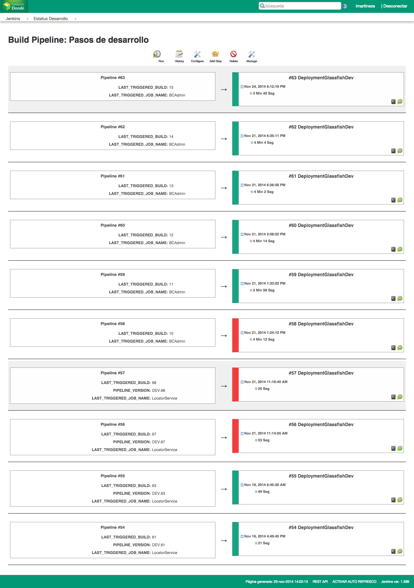

# Jenkins Theme

CSS and JS to implement a theme for [Jenkins CI](http://jenkins-ci.org/).

### Before


### After





##Before start

Download the next files in $JENKINS_HOME/userContent/:

1. style.min.css
2. app.min.js
3. app.delivery.pipeline.min.js

## Usage

1. Install the [Simple Theme Plugin for Jenkins](https://wiki.jenkins-ci.org/display/JENKINS/Simple+Theme+Plugin)
2. Navigate to Jenkins > Manage Jenkins > Configure System > Theme
3. Set _URL of theme CSS_ to `/userContent/style.min.css` (or another URL of your setting/choosing)
4. Set _URL of theme JS_ to `/userContent/app.min.js` (or another URL of your setting/choosing)

## Building

```
npm install
grunt
```

## To manually change SimpleTheme CSS and JS values

1. Edit: `$JENKINS_HOME/org.codefirst.SimpleThemeDecorator.xml` with code below
2. Restart Jenkins

```
<?xml version='1.0' encoding='UTF-8'?>
<org.codefirst.SimpleThemeDecorator plugin="simple-theme-plugin@0.3">
  <cssUrl>http://css.cdn.rackspace.com/canon-jenkins/style.css</cssUrl>
  <jsUrl>http://js.cdn.rackspace.com/canon-jenkins/app.min.js</jsUrl>
</org.codefirst.SimpleThemeDecorator>
```

Thanks to @rackerlabs
